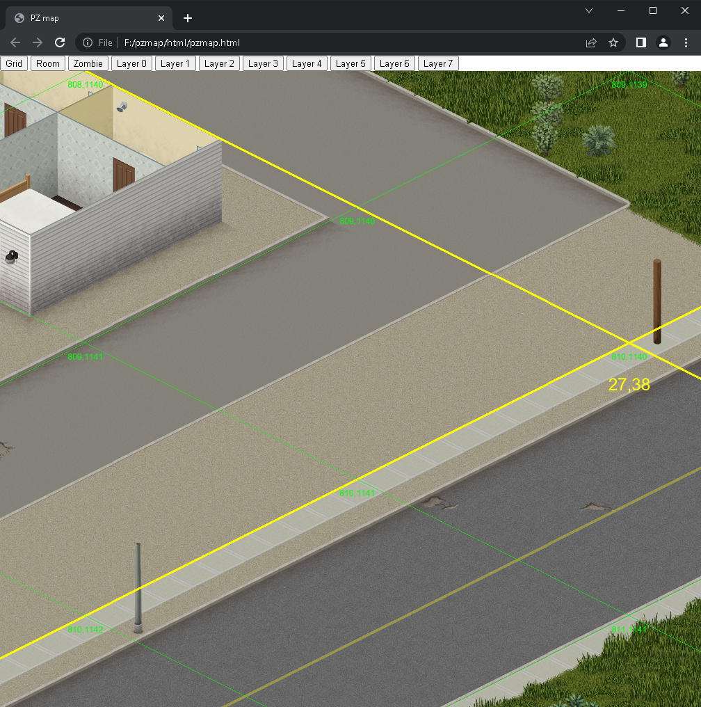
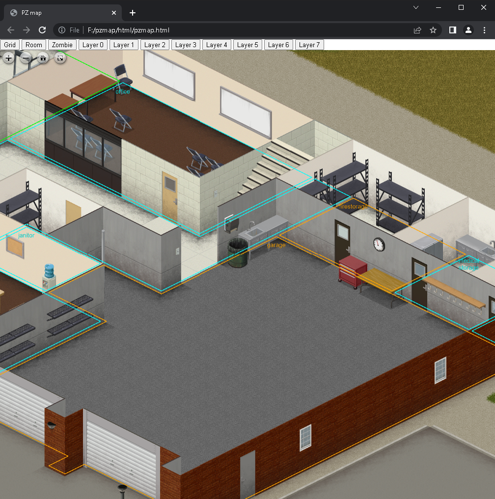

# pzmap2dzi
pzmap2dzi is a command-line tool running on Windows to convert Project Zomboid map data into [Deep Zoom format](https://en.wikipedia.org/wiki/Deep_Zoom).

# Features

- Supports both python 2.0 and python 3.0
- HTML viewer for viewing the generated Deep Zoom image.
- Various plant rendering configurations (snow, flower, tree size, etc.).
- Supports multi-thread acceleration
- Supports resuming from a breakpoint
- Supports map grid and room info rendering
- Supports game version 41.68

# Requirement
- The full output size for game version 41.68 is around 1.1TB and consists of 1.3M files. Make sure your output to a hard drive has enough free space.
- The rending process will take a very long time, so it's better to have a high-performance CPU, hard drive, and large memory. 
    - (The rending took around 18 hours on an AMD 3700X with 64GB DDR4 2133 memory and a SATA3 mechanical hard drive using a 16 thread setting)

# How to run

1. Install python
2. Clone or download the project
3. install requirements

    `python -m pip install -r requirements.txt`
4. Edit the `pz_path.txt` file to contain the correct path where your ProjectZomboid located on your computer
5. Edit the `out_path.txt` file to contain the desired output path
6. run the tool

    `run.bat`

# Change rendering configurations
- Change thread numbers (default is 16 threads)
    - In the `scripts/` folder, you can edit the starter command in the following files
```
unpack_texture.bat
render_base.bat
render_grid.bat
render_room.bat
```
    - Change `-m 16` to `-m 4` to use only four threads.
- Do not render grid and room info
    - Remove the calling of `render_grid.bat` and `render_room.bat` from `run.bat`
- Config a hotkey to elegantly stop rendering at a breakpoint so you can resume later
    - Similar to the config of thread numbers, add `-s <hotkey>` to starter commands
        - For example, `-s "<f9>"` make the rendering process stop when you hit F9
    - To resume, run `run.bat` again

# How to start the HTML viewer
After the rendering, you get an `html` folder in your output path.
```
html
├── base/
├── grid/
├── openseadragon/
├── room/
├─ chrome_allow_file(need close chrome first).bat
├─ chrome_no_sicurity.bat
├─ pzmap.html
└─ run_server.bat
```

Directly open `pzmap.html` will NOT work, as the Cross-Origin Resource Sharing (CORS) Policies will refuse to load Deep Zoom tiles from your locale disk by default.

There are two ways to bypass CORS:
1. Start a server and host your files on your drive
    - run `run_server.bat`
    - Afterwards, you can open `http://localhost:8880/pzmap.html` to view the image
2. If you are using Google Chrome with the default install path, you can do one of the followings:
    - open `pzmap.html` in a standalone tab with all web security disabled.
        - To do this, run `chrome_no_sicurity.bat`
    - restart Chrome to allow locale HTML access to locale files.
        - To do this, you close all opening Chrome tabs
        - Then run `chrome_allow_file(need close chrome first).bat`

# How to use the HTML viewer
- To switch floors, use the button form `Layer0` to `Layer7` on top of the page
- To enable/disable the grid, use the `Grid` button
    - (Position of the grid will adjust according to the current floor)

    
- To enable/disable room info, use the `Room` button
    - (Display room info of the current floor)

    
