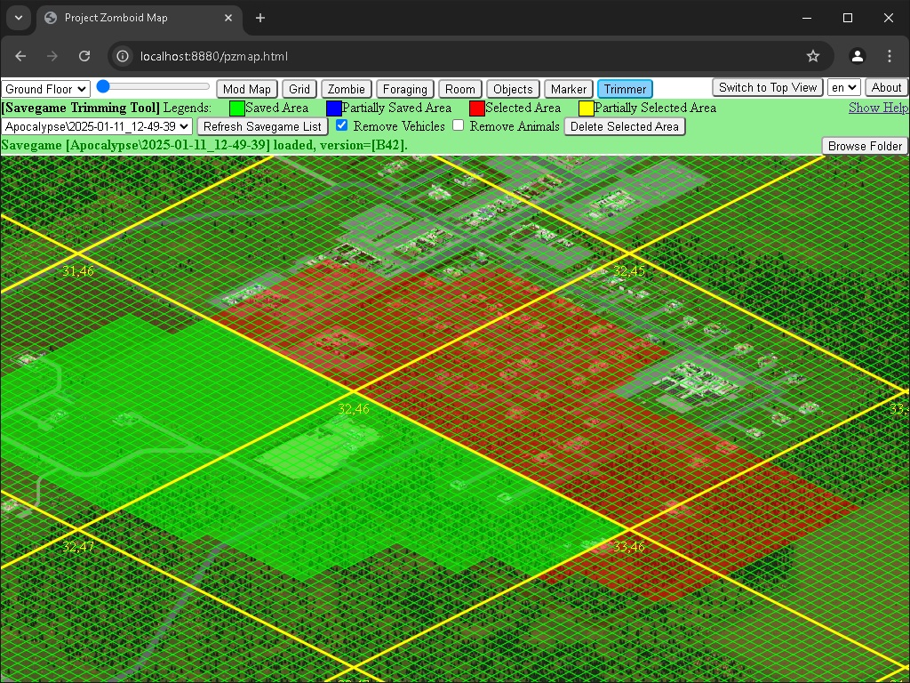
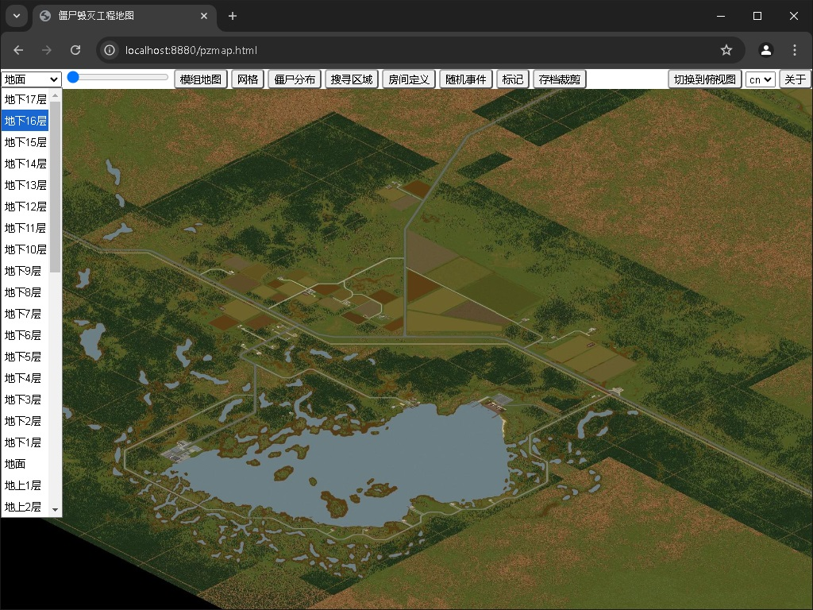
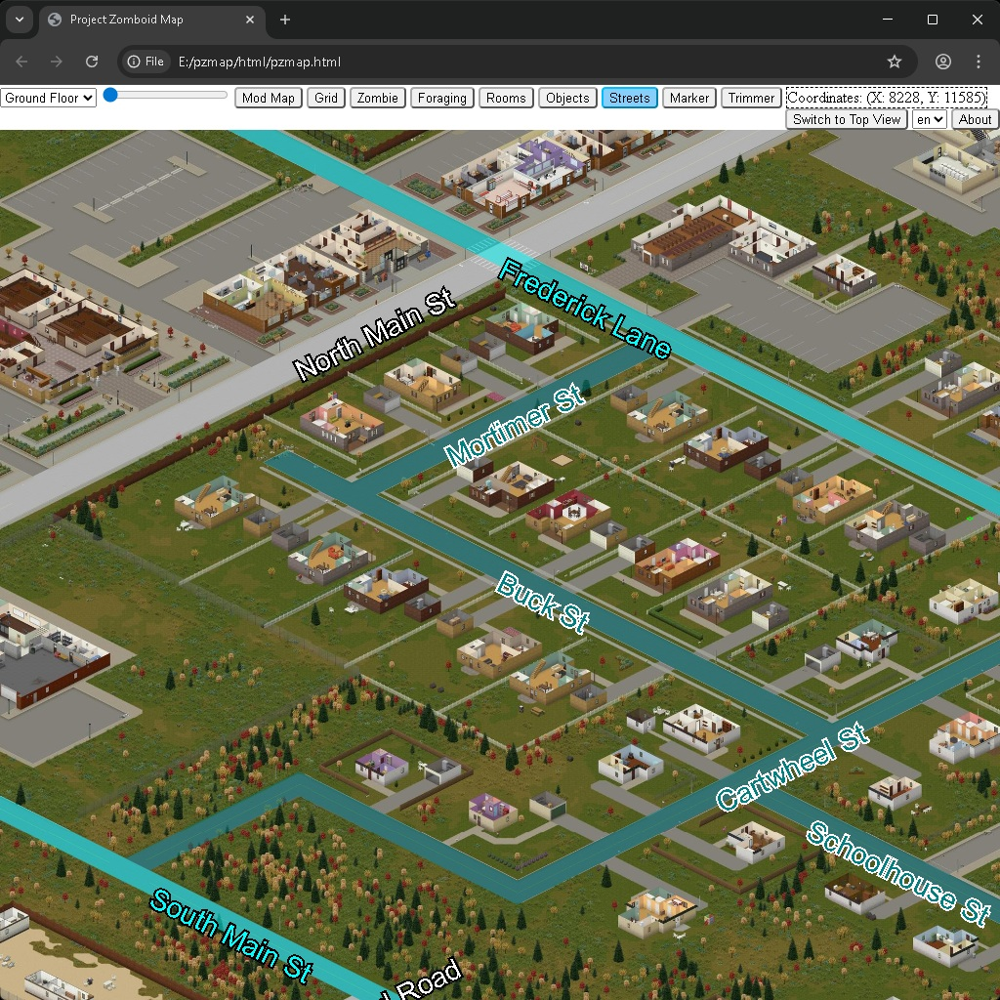

# pzmap2dzi
pzmap2dzi is a command-line tool for Windows that converts Project Zomboid map data into [Deep Zoom format](https://en.wikipedia.org/wiki/Deep_Zoom).

## Now with streets overlay

  <table>
  <tr>
    <td></td>
    <td></td>
    <td></td>
    <td></td>
  </tr>
  <tr>
    <td>Marking</td>
    <td>Local savegame trimmer</td>
    <td>I18n support</td>
    <td>Streets</td>
  </tr>
  </table>

# Features

- Ability to render mod maps as switchable overlays.
- Featured overlay maps include zombie heatmaps, foraging zones, story areas, etc.
- HTML viewer for displaying the generated Deep Zoom image in both isometric and top-down views.
- Tools for trimming local saved games.
- Options for editing, exporting, and importing customized marks.
- Internationalization (I18n) support.
- Multi-thread acceleration for improved performance.
- Tested with game versions 41.78.16 and 42.6.0 UNSTABLE on both Python 2.7 and Python 3.11.
- Refer to the [change log](./docs/change_log.md) for additional updates.

# Quick Start

- Convert map data using the [render engine](./docs/user_manual_render_engine.md).
- Set up and use the [web viewer](./docs/user_manual_web_viewer.md).
- Explore helpful [utility scripts](./docs/utility_scripts.md).

# Documentation

- Access the project [documentation](./docs/docs.md) for developers.
