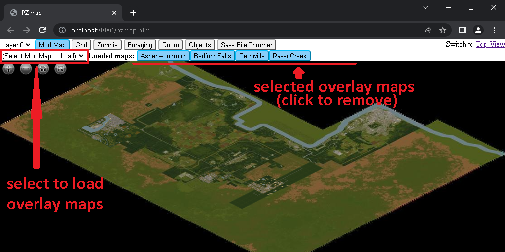
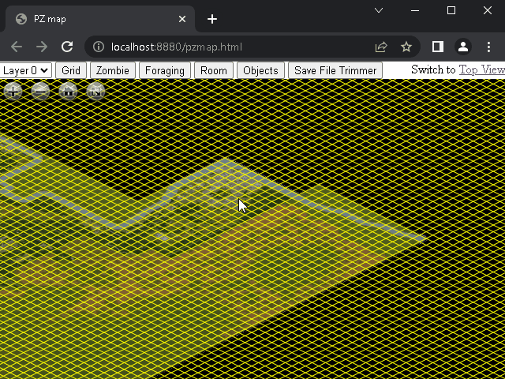
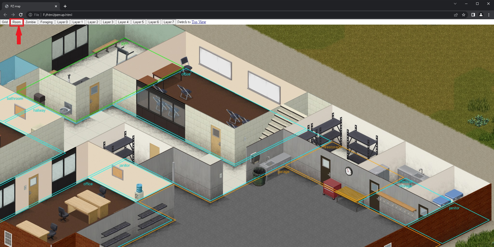
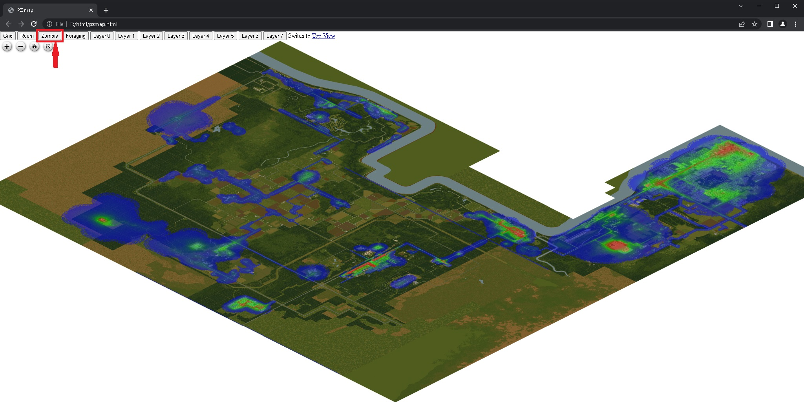
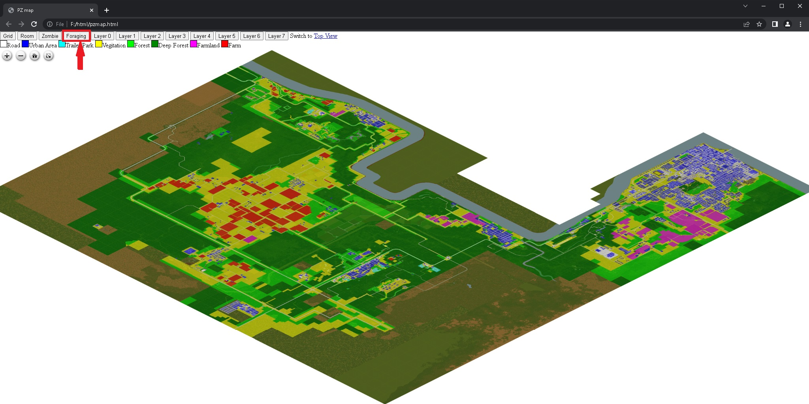
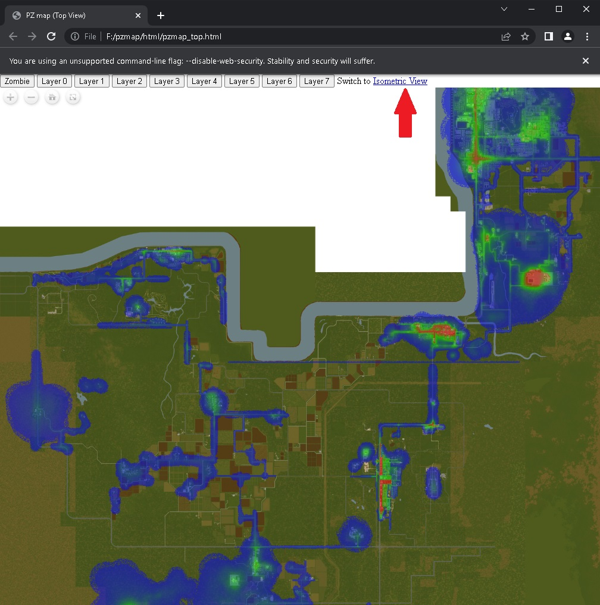

# pzmap2dzi
pzmap2dzi is a command-line tool running on Windows to convert Project Zomboid map data into [Deep Zoom format](https://en.wikipedia.org/wiki/Deep_Zoom).

# Now fully suport B42 basement

<p float="left">
  <table>
  <tr>
    <td></td>
    <td></td>
    <td></td>
    <td></td>
  </tr>
  <tr>
    <td>Marking</td>
    <td>Basement with transparent roof layer</td>
    <td>Local savegame trimmer</td>
    <td>I18n support</td>
  </tr>
  </table>
</p>

# Features

- HTML viewer for viewing the generated Deep Zoom image in both isometric and top down
- Render mod maps as switchable overlay
- Featured overlay map: zombie-heatmap, foraging zones, story area, etc.
- Tools for local saved games trimming
- Customized marks edit/export/import
- I18n support
- Multi-thread acceleration
- Tested with game version 41.78.16 and 42.0.2 UNSTABLE on both python 2.7 and python 3.11

# Requirement
- **Storage**: The full output size of isometric map for game version 41.78 is around 450GB (or 2.5TB with lossless png format) and consists of 4M files. SSD is recommended as high I/O bandwidth can reduce render time.
- **Memory**: Each worker requires approximately 1 GB of memory to work. An additional 4 GB of shared memory is needed if the shared memory acceleration is enabled. For example, the program will need 16 GB + 4 GB memory when using 16 threads with shared memory acceleration.
- **Time**
    - Test machine spec & config
        - CPU: AMD Ryzen 7 5700G @ 3.8 GHz (8 core, 16 threads)
        - Memory: 64GB DDR4 2133
        - Output Storage: NVME SSD
        - Render Settings: 16 thread, shared memory acceleration enabled
        - Game Version: 41.78.16
    - The isometric map rending took around 3.5 hours (or even slower with lossless png format)
    - The zombie heatmap took about half of the isometric map render time
    - If you choose to render only top view map, output size will be around 500MB and can be done within half hour.
- **Note**
    - Shared memory acceleration may not compatible with [Hybrid Architecture](https://www.intel.com/content/www/us/en/developer/articles/technical/hybrid-architecture.html) CPUs and could result in render failures
    - Shared memory acceleration is unstable with eariler python builds because of [buggy implementation](https://stackoverflow.com/questions/65968882/unlink-does-not-work-in-pythons-shared-memory-on-windows). Python 3.10.9+ or 3.11.1+ recommended
    - To turn on shared memory acceleration, see *Change rendering configurations* section below

# How to run

1. Install [Python](https://www.python.org/downloads/)
2. Clone or download the project
3. Install requirements

   - If your python version is 2.7, install VCForPython27 first. You can find it [here](https://web.archive.org/web/20210106040224/https://download.microsoft.com/download/7/9/6/796EF2E4-801B-4FC4-AB28-B59FBF6D907B/VCForPython27.msi) or [here](https://github.com/reider-roque/sulley-win-installer/blob/master/VCForPython27.msi)
   
   - run `install_requirements.bat`
4. Update variables in the `conf/conf.yaml` file
   - Change the `pz_root` variable to ProjectZomboid game location on your computer
   - Change the `output_path` variable to the desired output path
   - Change the `mod_root` variable to steam workshop path if you want to render a mod map
   - Add desired mod maps to `mod_maps` list (For more infor about how to add mod maps see [adding mod maps](./docs/adding_mod_maps.md))
   - See [examples](./conf/examples) for more config details

5. Run the tool

   Run `run.bat` to render all isometric and top view maps

# Change rendering configurations
   See `conf/conf.yaml` and `run.bat` for more detials. You can also use `scripts/gen_example_conf.py` to generate some configuration examples.

- Turn on shared memory acceleration
    - In `render_conf` section of `conf.yaml`, set `enable_cache` to `ture`

- Do not render zombie heatmap
    - Remove arguments `zombie zombie_top` from `run.bat`
- Do not render foraging zones
    - Remove arguments `foraging foraging_top` from `run.bat`
- Do not render top view map
    - Use `run_isometric_only.bat` instead of `run.bat`
- Do not render isometric view map
    - Use `run_top_view_only.bat` instead of `run.bat`

# How to start the HTML viewer
After the rendering, you get an `html` folder in your output path.
```
html
├── map_data/
├── openseadragon/
├── pzmap/
├─ chrome.bat
├─ chrome_allow_file(need close chrome first).bat
├─ chrome_no_sicurity.bat
├─ pzmap.html
├─ pzmap.js
├─ pzmap_config.json
├─ run_server.bat
├─ server.py
└─ server_config.txt
```

Directly open `pzmap.html` will NOT work, as the Cross-Origin Resource Sharing (CORS) Policies will refuse to load Deep Zoom tiles from your locale disk by default.

There are two ways to bypass CORS:
1. Start a server and host your files on your drive
    - run `run_server.bat`
    - Afterwards, you can open `http://localhost:8880/pzmap.html` to view the image
2. If you are using Google Chrome with the default install path, you can do one of the followings:
    - open `pzmap.html` in a standalone tab with all web security disabled.
        - To do this, run `chrome_no_sicurity.bat`
    - restart Chrome to allow locale HTML access to locale files.
        - To do this, you need close all opening Chrome tabs
        - Then run `chrome_allow_file(need close chrome first).bat`

# How to use the HTML viewer
- To switch floors, use the button form `Layer0` to `Layer7` on top of the page
- To enable mod maps overlay, use the `Mod Map` button and then select mod maps

    

- To enable/disable the grid, use the `Grid` button
    - (Position of the grid will adjust according to the selected layer)

    
- To enable/disable room info, use the `Room` button
    - (Display room info of the current layer)

    
- To enable/disable zombie heatmap, use the `Zombie` button

    

- To enable/disable foraging zones, use the `Foraging` button

    

- To switch between isometric view and top view, use the view switch link

    

- To use Save File Trimmer
    - Edit `server_config.txt` and set `save_path` variable to your save folder before start server (The default value is set for Windows 10)
    - The viewer must start in server mode using `run_server.bat`

    
