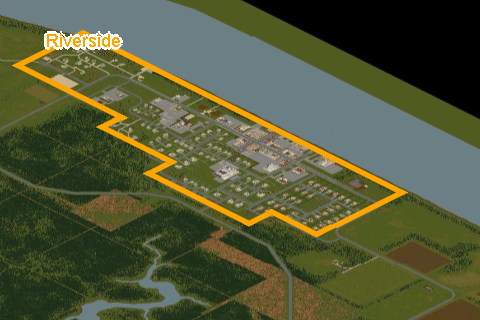

# Marker System Design and Optimizations
## Overview
The marker system is responsible for managing, rendering, and interacting with map markers in the pzmap2dzi project. Markers can represent points or areas on the map, and support features such as selection, editing, and dynamic visibility based on zoom and layer.

This document introduces two major performance optimizations:

1. Multi-Rect Area Mark Rendering with Accelerated Neighbour Detection
2. Render Acceleration via R-Tree Indexing for Visible Range Query

## Multi-Rect Area Mark Rendering with Accelerated Neighbour Detection
### Motivation
Previously, area markers were rendered as single rectangles, limiting flexibility and visual accuracy for complex shapes. Multi-rect support allows area marks to consist of multiple adjacent or overlapping rectangles, enabling more precise region representation.

### Implementation

**Area Mark Structure:**  
Each area mark is composed of multiple rectangles, each defined by its own position and size.

**Neighbour Detection:**  
To ensure borders are rendered accurately (avoiding redundant borders between adjacent rectangles) the system detects neighbouring rectangles using an accelerated approach.

A [sweep line algorithm](https://www.cs.princeton.edu/courses/archive/fall05/cos226/lectures/geosearch.pdf) is employed to efficiently identify adjacent rectangles. This process leverages an auxiliary spatial index (such as a B-tree) to quickly locate neighbours, reducing the need for brute-force comparisons. The algorithm operates in O(m log n) time, where m is the number of adjacency checks performed.

**Border Calculation:**  
For each rectangle, the system determines which border segments are exposed (not shared with a neighbouring rectangle) and renders borders only on those segments.

**Benefits:**  
- *Visual Accuracy:* Multi-rect areas can represent complex shapes with precise border rendering.  
- *Performance:* Accelerated neighbour detection enables efficient rendering, even for area marks containing many rectangles.

  <table>
  <tr>
    <td></td>
  </tr>
  <tr>
    <td>Multi-Rect Area Mark</td>
  </tr>
  </table>

**References**
- See [render.js](../../html/pzmap/mark/render.js) and [draw.js](../../html/pzmap/mark/draw.js) for implementation details.

## Render Acceleration via R-Tree Indexing for Visible Range Query
### Motivation
Rendering all markers regardless of visibility is inefficient, especially for large maps with many markers. To optimize performance, only markers within the current visible range should be rendered.

### Implementation

**R-Tree Spatial Indexing:**  
Markers are organized in an R-tree, enabling efficient spatial queries for fast retrieval of markers within a given area. The index adapts to both "top" and "iso" map modes, using bounding boxes or transformed coordinates (x + y, x - y) as appropriate.

**Dynamic Range Query:**  
During each render or update, the system queries the R-tree for markers that intersect the current viewport. Only these markers are sent to the renderer, minimizing unnecessary processing.

**Layer and Zoom Filtering:**  
The R-tree query incorporates layer and zoom level filters, ensuring that only markers relevant to the current map state are considered for rendering.

**Advantages:**  
- *Performance:* Limits rendering to visible markers, reducing DOM updates and overlay complexity.  
- *Scalability:* Efficiently supports thousands of markers with minimal impact on performance.  
- *Responsiveness:* Maintains smooth map interactions (pan, zoom, layer changes) by filtering markers at query time.

**References**
- See [memdb.js](../../html/pzmap/mark/memdb.js) for implementation details.